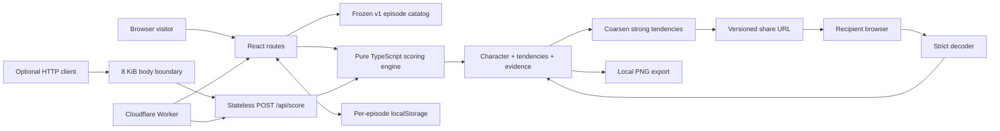
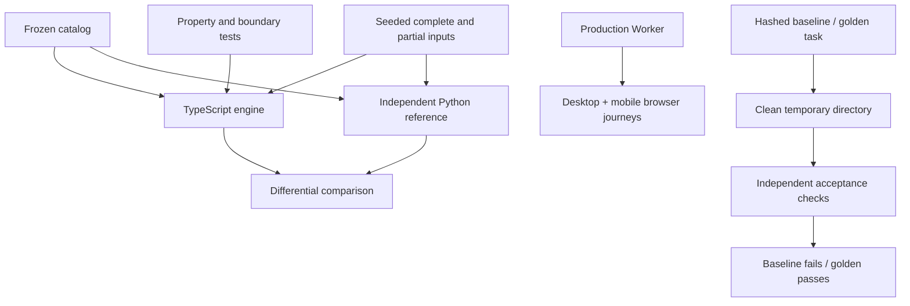

# System architecture

Plot Twist is a local-first interactive application with an optional stateless server-side scoring interface. The core product needs neither identity nor durable server state.



## State and data contracts

### The answer set is authoritative

A scene and choice have stable IDs. Each choice contains a four-element integer vector; shipped scenes measure one dimension at a time. UI state stores `{sceneId, choiceId}` records, a cursor, pack ID, and update time. It never stores independently mutable accumulated scores or a cached character.

On revision, a choice replaces the existing record at the scene's canonical position. Future recorded answers remain available. A result always recomputes from current answers. This prevents a common class of additive-update/resume bugs.

### Scoring

For dimension `d`, sum the selected contributions `raw[d]`. Normalize against the sum of that dimension's maximum absolute weights across **answered** scenes:

```text
score[d] = round(50 + 50 × raw[d] / maximum[d])
```

Unanswered dimensions display 50 and “Balanced.” Final sharing requires all scenes. Positive raw values map to bit 1, non-positive to bit 0; energy, logic, order, vision form the four-bit character code. A zero is explicitly a tie convention, not an inferred preference. Complete shipped episodes cannot tie because each axis sums three odd integers.

The current range is −9 to +9. The labels are descriptive tendencies, not confidence estimates. All character codes are exhaustively reachable. Input answer order cannot change scores, and the function does not mutate its arguments.

Catalog indexing is O(S); scoring is O(A × C × D), where shipped C=4 and D=4. Thus scene lookup is O(S+A), with O(S+A) working memory and output evidence. The engine is intentionally simple and auditable.

### Versioning and shared privacy

The `v1` namespace freezes the combination of pack IDs, scene/choice IDs, weights, axis order, normalization, and character mapping. Copy may improve without changing meaning; semantic changes require a new version and retained decoder/content or an explicit unsupported-version state.

Canonical generated token:

```text
v1.pilot.5_-3_1_-5
```

Each component preserves its sign and caps absolute magnitude at 5: 5, 7, and 9 all serialize as 5. This retains the displayed tendency category while avoiding uniquely identifying all choices at an extreme. Individual choices and names are not serialized. Aggregate sharing still reveals tendencies; it is not encryption or a promise against all inference.

The v1 decoder accepts valid odd values through 9 for explicit compatible input, but the application never generates ±7 or ±9 links. Directly typed links are unverified entertainment data, not proof someone completed an episode. Shared result displays have no answer receipts. A browser with a matching completed local episode can show its own more detailed evidence.

A frozen contract hash test detects changes to IDs/weights/character mapping. There is no silent server data migration because there is no server data store.

### Device persistence

Keys are `plottwist.session.v1.{pilot|office|friends}`. JSON parsing checks size, version, pack, answer validity, prefix order, finite timestamp, and cursor bounds. Invalid state is ignored and a fresh episode loads. Storage exceptions degrade to in-memory play. A `storage` deletion event clears another open quiz tab so erased answers are not silently restored.

Concurrent edits to the same episode use last-writer-wins local storage; this is not collaborative editing. Clearing data removes local answers but cannot revoke copied links/cards.

## Rendering and runtime

React 19 runs through Vinext/Vite into a Cloudflare Worker. Server routes render the shell and catalog; client components initialize browser-only state after hydration. Native anchors intentionally start a fresh route document, making URL-derived state initialization and local resume predictable. This trades some SPA navigation speed for a simpler lifecycle.

Base UI/Shadcn radio, progress, and select primitives provide interactive semantics. Custom CSS implements the retro print palette and responsive layouts. Sixteen individual 640 × 640 WebP portraits map to frozen character codes through `characterArtPath`. Cast, detail, home, chemistry, result, and Canvas export use this same mapping. Presentation-only `stories.ts` supplies original character fiction and three-act episode framing; choice reactions live beside existing choices. These copy and artwork changes do not change the v1 scoring contract. Gallery art loads lazily; result and hero portraits load eagerly.

Optional WebMCP exposes `read_quiz_scene` and `select_quiz_answer`. It is feature-detected, shares UI actions, includes the complete scene context, and cleans up with AbortSignal. It does not silently complete the quiz.

## Server boundary

`POST /api/score` is a public, stateless reference endpoint. It requires JSON and bounds the **streamed** body to 8 KiB regardless of Content-Length. It validates pack, count, duplicate scene IDs, foreign choices, and malformed records. Responses are non-cacheable. No request data is written to application storage.

The ordinary browser flow does not call this endpoint. The API intentionally supports partial scores and labels completeness explicitly. It is not an identity or verification endpoint. Platform-level rate limiting is the host's responsibility; there is no distributed per-user rate-limit promise.

## Verification architecture



The evaluation runner is isolated for reproducibility, **not security**. Untrusted code must run in a separately provisioned VM/container with resource and network controls. A local timeout cannot enforce filesystem or network isolation.
