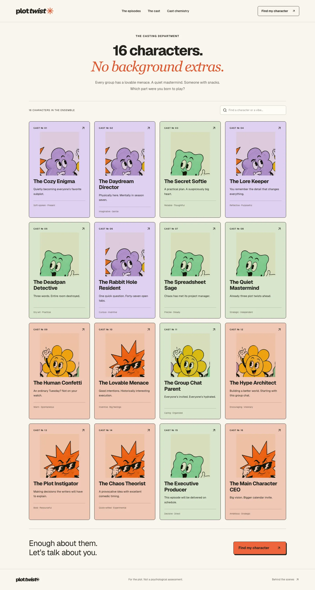
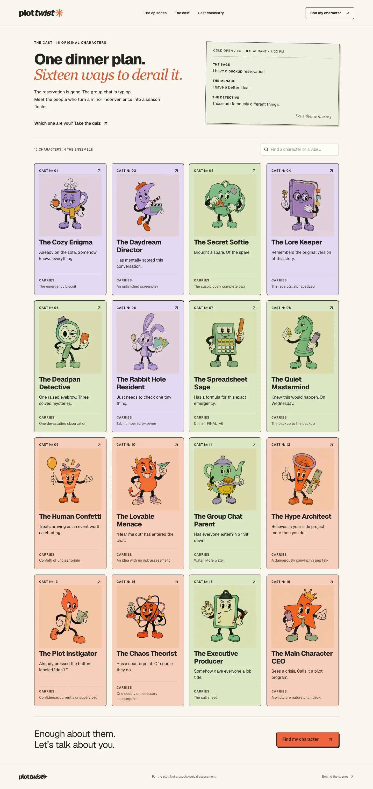

# LLM design-judge review

Reviewed on **2026-09-05** after the user reported repeated character art and asked for a clearer, funnier, more story-driven experience.

## Method and rubric

An independent product-review agent inspected the four baseline desktop screenshots (home, cast, quiz, shared result), then eight revised desktop/mobile screenshots and relevant source. It inspected three final mobile screenshots after a second implementation pass. A separate code-review agent checked functionality, accessibility presentation, privacy, asset consistency, and scoring-contract preservation. The implementation owner ran the tests.

The rubric and anchors were fixed before the revision: **0** absent/broken; **5** usable but generic/inconsistent; **8** strong with limited gaps; **10** exceptional with no substantial issue observed. The weighted total is `sum(score / 10 × weight)`. These are subjective LLM judgments, not user-study results or a full accessibility audit. Review was collaborative, not blinded: the judge saw the requested improvements and implementation context. Scores are evidence for iteration, not a scientific product-quality metric.

| Criterion                          |   Weight | Baseline /10 | First revision /10 | Final /10 |
| ---------------------------------- | -------: | -----------: | -----------------: | --------: |
| First-visit clarity                |      20% |          7.5 |                  9 |         9 |
| Distinct character visual identity |      25% |            2 |                  9 |         9 |
| Storytelling                       |      20% |          5.5 |                  8 |         8 |
| Humor                              |      15% |            7 |                8.5 |       8.5 |
| Visual craft                       |      10% |            7 |                  8 |         8 |
| Usability/accessibility            |      10% |            8 |                  8 |       8.5 |
| **Weighted total /100**            | **100%** |     **56.5** |          **85.25** | **85.75** |

## Evidence and implementation responses

| Finding                                                                | Change                                                                                                                             | Verification                                                                                                                     |
| ---------------------------------------------------------------------- | ---------------------------------------------------------------------------------------------------------------------------------- | -------------------------------------------------------------------------------------------------------------------------------- |
| Sixteen names share four sprites, with neighboring-character fragments | Sixteen individual mascot silhouettes, props, and poses; code-based asset mapping                                                  | Judge inspected the full gallery; both browser projects loaded 16 unique portrait URLs; content test checks unique binary hashes |
| Main copy does not plainly explain the quiz                            | Opening says “A 3-minute personality quiz,” explains 12 dilemmas and 16 original characters, with a direct “Find my character” CTA | Desktop and mobile opening screens                                                                                               |
| Cast teaser is mostly empty; no shared world                           | Home displays named character portraits; a lost dinner reservation links the home stage to the cast-page opening script            | Home and cast screenshot review                                                                                                  |
| Result describes a personality but never stages it                     | Sixteen fictional cold opens with setup, character action, and comic consequence                                                   | Result and detail pages; all story records are unique                                                                            |
| Quiz reactions are generic and repetitive                              | 144 answer-specific narrator reactions; three acts per episode                                                                     | Choice-pairing review, unique-reaction content test, browser selection/act-transition test                                       |
| Result lacks a connection to actual play                               | A local-only callback quotes one real chosen answer, separately from labeled character fiction                                     | Source inspection; existing complete-play and saved-evidence tests                                                               |
| Mobile hides the new story framing                                     | Current act title and note shown above the mobile scene                                                                            | Final mobile quiz screenshot                                                                                                     |
| Cast search ignores new visible card copy                              | Search includes entrances and recurring props                                                                                      | Browser search for “biscuit” finds Cozy Enigma                                                                                   |
| Shared result claims “Revisit my answers” without saved evidence       | “Play this episode” for shared summaries; revisit remains for matching local results                                               | Both browser projects check shared ownership wording                                                                             |
| Mobile navigation disappears                                           | Visible wrapping navigation row for episodes, cast, chemistry                                                                      | Final mobile screenshots and browser visibility checks                                                                           |
| Result explanatory text crowds controls                                | 13px minimum and added spacing for privacy/method notes                                                                            | Final result screenshot; axe scans remain clear                                                                                  |

## What the judge still marked down

The questions remain primarily independent vignettes rather than a branching narrative. Some portrait backgrounds visibly retain their rectangular print texture. The final pass did not inflate storytelling or visual-craft scores for small navigation fixes. The judge found no remaining blocker within the requested scope.

## Visual record

Baseline and first full revision, captured at the same 1440px desktop width. The final mobile-navigation and shared-result wording fixes came after these cast screenshots and do not change the desktop cast composition.

| Before                                                                | Revised                                                                   |
| --------------------------------------------------------------------- | ------------------------------------------------------------------------- |
|  |  |

See [validation](VALIDATION.md) for executed checks and limitations, and [art direction](ART_DIRECTION.md) for the complete cast identity mapping.
